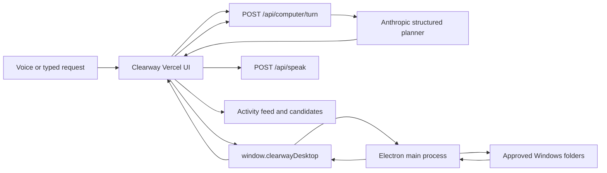

# Design Document: Clearway Computer Use MVOP

## Overview

Clearway keeps the existing Next.js/Vercel application as the visible product and adds a thin Electron Windows shell. The web application owns conversation, SSDI case state, agent orchestration, results, and narration. Electron owns folder consent and local read-only tools. Anthropic chooses typed actions from arbitrary requests; it never receives unrestricted machine access.

This design implements Requirements C1-C11 and deliberately excludes browser automation and general Windows UI Automation from the two-hour MVOP.

## Design Principles

1. **Real tools, never staged output.** A successful statement requires a successful native result.
2. **Generic intent, narrow capabilities.** Language is open-ended; executable tools are typed and constrained.
3. **Local first.** Traverse, parse, OCR, and preview locally; share only bounded excerpts.
4. **Narrate state, not theater.** Speech reflects actual action events and counts.
5. **Preserve the working application.** Computer use is an extension of the current workspace, not a rewrite.

## Technology Stack

| Concern | Choice | Requirements |
| --- | --- | --- |
| Hosted interface | Existing Next.js App Router on Vercel | C1, C7, C11 |
| Windows shell | Electron `BrowserWindow` and preload `contextBridge` | C2, C8 |
| Planner | Existing Anthropic SDK with Zod structured output | C3, C9 |
| Local execution | Node filesystem APIs in Electron main | C4, C8 |
| PDF text | `pdf-parse` | C4, C5 |
| Image OCR | `tesseract.js`, English worker | C4, C5 |
| Speech input | Existing Deepgram transcription route | C3, C10, C11 |
| Speech output | Existing Deepgram Aura 2 route; Mandarin browser/system voice | C6, C11 |
| Forms | Existing Anvil adapters and packet route | C11 |

## High-Level Architecture



The loop continues until the planner returns `finish`, `clarify`, or `error`, or the client reaches its action/time limit.

## Runtime Flow

### 1. Desktop bootstrap (C2, C8)

1. Electron resolves `--url`, `CLEARWAY_WEB_URL`, or the deployed default.
2. It derives one allowed origin and refuses navigation elsewhere.
3. It creates a sandboxed `BrowserWindow` with a preload file.
4. The preload exposes only `getEnvironment`, `chooseRoots`, `executeTool`, and `onActivity`.
5. IPC handlers reject calls whose sender origin differs from the configured origin.

### 2. Folder approval (C2, C5)

1. The renderer detects `window.clearwayDesktop`.
2. The user opens the native multi-folder picker.
3. Electron stores canonical paths in an in-memory map keyed by random root IDs.
4. The renderer receives root IDs and display labels. Authorization disappears on exit.

### 3. Request planning (C3, C9)

1. The existing voice hook transcribes the request, or the user types it.
2. The renderer sends the request, locale, sanitized environment, recent turns, and prior tool result to `/api/computer/turn`.
3. Anthropic returns one schema-validated `Computer_Turn_Response`.
4. The renderer either invokes one tool, presents a grounded result, asks a necessary clarification, or reports failure.

### 4. Local search (C4, C5)

1. `search_files` walks only selected roots and records metadata.
2. It scores normalized runtime terms against names and paths.
3. It extracts text from strong metadata matches and a bounded set of likely PDF/image/text candidates.
4. It rescans content evidence, ranks candidates, and returns opaque IDs.
5. A later `extract_text` action may inspect a specific candidate more deeply.

### 5. Activity and narration (C6)

Native execution emits factual `Activity_Event` objects. The renderer appends each event to an `aria-live` activity list. Important events enter a serialized TTS queue. The queue never invents counts and does not block execution if speech fails.

### 6. Result use (C7)

Candidate cards show actual filename, display path, modification time, and match evidence. Supported images can be previewed from bounded data returned by Electron. `open_candidate` uses the recorded candidate path; the renderer cannot provide a path. An optional in-memory association links the candidate to a current checklist need.

## Interfaces

```ts
type ComputerToolName =
  | "search_files"
  | "extract_text"
  | "preview_candidate"
  | "open_candidate";

interface ApprovedRoot {
  id: string;
  name: string;
  displayPath: string;
}

interface ComputerEnvironment {
  platform: "win32";
  release: string;
  arch: string;
  roots: ApprovedRoot[];
  capabilities: ComputerToolName[];
  limits: {
    maxFiles: number;
    maxDepth: number;
    maxFileBytes: number;
    maxExcerptCharacters: number;
  };
}

type ComputerToolRequest =
  | {
      tool: "search_files";
      args: {
        query: string;
        terms: string[];
        extensions: string[];
        maxResults: number;
      };
    }
  | { tool: "extract_text"; args: { candidateId: string } }
  | { tool: "preview_candidate"; args: { candidateId: string } }
  | { tool: "open_candidate"; args: { candidateId: string } };

interface CandidateFile {
  id: string;
  name: string;
  displayPath: string;
  extension: string;
  size: number;
  modifiedAt: string;
  score: number;
  evidence: string[];
  excerpt?: string;
  previewDataUrl?: string;
}

interface ActivityEvent {
  id: string;
  phase: "started" | "progress" | "completed" | "failed";
  message: string;
  speak: boolean;
  createdAt: string;
}
```

`POST /api/computer/turn` accepts at most twelve history items and one bounded tool result. It returns:

```ts
type ComputerTurnResponse =
  | { state: "act"; narration: string; action: ComputerToolRequest }
  | { state: "finish"; narration: string; candidateIds: string[] }
  | { state: "clarify"; narration: string }
  | { state: "error"; narration: string };
```

## Security and Privacy

- Renderer Node integration is disabled; context isolation, sandboxing, and web security remain enabled.
- IPC validates sender origin, request shape, root IDs, candidate IDs, canonical path containment, size limits, and supported extensions.
- No tool accepts commands, scripts, URLs, or renderer-selected absolute paths.
- Directory traversal skips symbolic links and known high-volume development/system folders.
- The server caps requests and excerpts, uses no-store responses, and does not log request contents or tool results.
- Local paths and candidate maps remain in Electron memory only.

## Correctness Properties

1. **Property P1 — Path containment (C2, C8):** every inspected candidate resolves beneath an active Approved_Root.
2. **Property P2 — Result provenance (C3, C10):** every returned candidate ID originated in the current native candidate map.
3. **Property P3 — No false success (C4, C6, C9):** a finish response with candidates is displayed only when those IDs exist in a successful tool result.
4. **Property P4 — Request independence (C3, C10):** changing the natural-language request changes runtime intent without requiring a code or configuration change.
5. **Property P5 — Bounded disclosure (C5):** no server-bound excerpt exceeds the configured character limit and no preview data is sent to the planner.
6. **Property P6 — Bounded execution (C9):** one request performs no more than eight native actions or sixty seconds.
7. **Property P7 — Narration truth (C6):** factual numbers in narration are sourced from tool results or activity events.
8. **Property P8 — Case isolation (C7, C11):** computer-agent state changes do not mutate confirmed Applicant_Case facts.

## Error Handling

- **No desktop bridge:** retain voice/forms and explain how to open Clearway Desktop.
- **No approved roots:** stop before planning a file action and offer the folder picker.
- **Access denied or locked file:** skip the file, count the failure, and continue within limits.
- **Unsupported/encrypted file:** label it unsupported; never treat it as a match from content.
- **OCR/parser failure:** preserve metadata evidence and report that content could not be read.
- **Anthropic failure:** preserve activity and results; offer retry or a new request.
- **Deepgram failure:** continue visually and retain typed input.
- **Action/time limit:** terminate with an honest partial-results message.

## Testing Strategy

- Unit-test Zod contracts, path containment, traversal bounds, token scoring, excerpt caps, candidate IDs, and response-state validation.
- Component-test bridge absent/connected states, folder consent, activity order, TTS failure, results, and keyboard access.
- Integration-test the planner with mocked real tool results and ensure it cannot claim undiscovered files.
- Run a fresh-input test using newly created, poorly named files whose contents determine the match.
- Run the existing voice, extraction, case, packet, accessibility, typecheck, and production-build suites.
