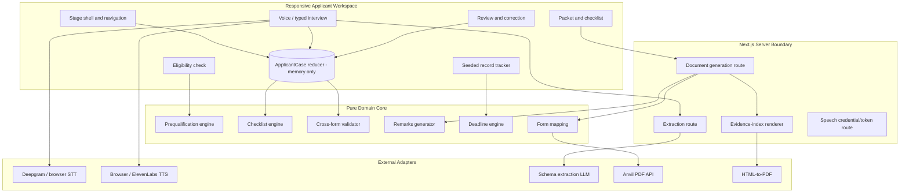
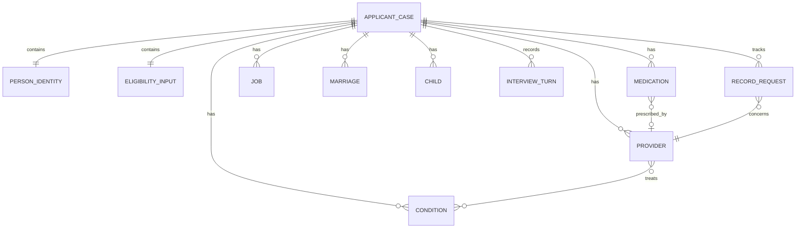
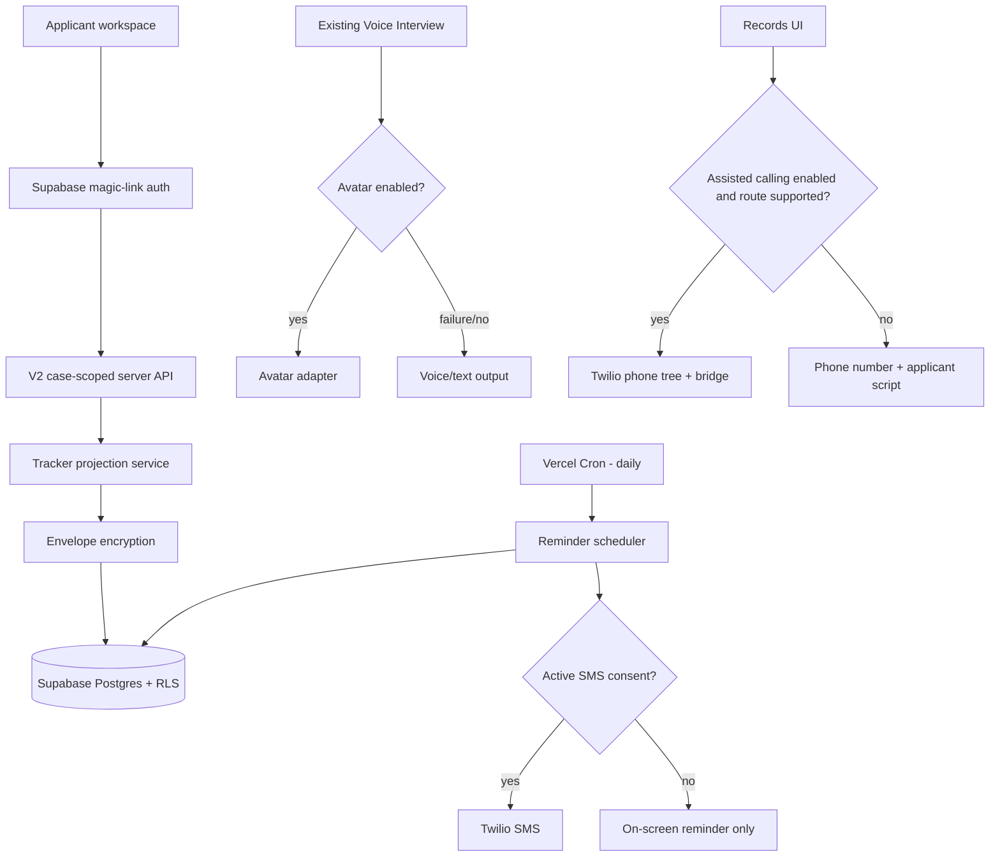

# Design Document

## Overview

Formless is a responsive, task-oriented application that helps a person evaluate possible non-medical SSDI issues, describe their medical and work history in ordinary language, review what was captured, generate a consistent application packet, and follow up on medical records. Its design must work for applicants who are tired, in pain, anxious, phone-only, unfamiliar with government terminology, or using assistive technology.

V1 is a complete hackathon product, not a visual prototype. It uses one synthetic case and in-memory React state, exercises real server-side Anvil integration when configured, and preserves deterministic demo fallbacks. V2 extends the same domain model and interfaces with encrypted tracker persistence, magic-link access, scheduled reminders, consented SMS, an optional avatar, and feature-flagged assisted calling.

The central architectural boundary is **deterministic rules and canonical data inside; replaceable services outside**:

- Eligibility estimates, document selection, deadline arithmetic, form consistency, overflow, Remarks, and evidence-index contents are pure and testable.
- Speech, language-model extraction, text-to-speech, Anvil, SMS, avatar rendering, and telephony are adapters behind explicit interfaces.
- A single `ApplicantCase` is the only mutable source used by the interview, typed path, review, document packet, checklist, and tracker.
- Candidate AI output is never authoritative. Field provenance and applicant confirmation decide what may enter generated documents.

## Design Principles

1. **One task at a time.** Each screen has one dominant action. Progress and secondary information remain visible without competing with the current decision.
2. **Conversation, not form recital.** Questions use applicant language. SSA field names, page layouts, and form-item codes remain inside mapping and validation modules.
3. **Never invent a consequential fact.** Unknown dates, names, earnings, treatment details, medication details, and work facts remain visibly unresolved.
4. **Enter once, reuse everywhere.** Shared facts live once in `ApplicantCase` and flow through every form and derived output.
5. **Applicant control is always visible.** The applicant can pause, type, review, edit, retry, download, sign, and file. The system does not impersonate, represent, or submit.
6. **Progressive disclosure over explanatory text.** The active task stays concise. Longer definitions, source rules, and explanations open only when requested or when an exception makes them relevant.
7. **Accessibility is structural.** Speech and typing are equal paths. Transcript visibility, semantic structure, keyboard use, large targets, reduced motion, zoom, and plain language shape the base components.
8. **Trust through restraint.** Strong hierarchy, familiar controls, precise states, and whitespace replace decoration. No card carpet, government-portal imitation, glass effects, gradient text, decorative metrics, or unnecessary badges.
9. **Failures preserve progress.** Service failure changes the available action, not the integrity of the case. No adapter can delete confirmed data.
10. **The transformation is the spectacle.** The demo's memorable visual event is natural speech becoming confirmed facts, then consistent forms and a concrete records plan.

## Technology Stack

### V1

| Concern | Choice |
| --- | --- |
| Framework | Next.js App Router and React |
| Language | TypeScript with strict mode |
| Styling | Tailwind CSS with project tokens; no unmodified default theme |
| UI primitives | shadcn/ui and Radix primitives where their semantics help |
| Design workflow | `skills/impeccable/` |
| State | React context plus `useReducer`; session memory only |
| Runtime validation | Zod |
| Document generation | Anvil Node SDK, server-side only |
| Speech-to-text | Deepgram streaming adapter; browser SpeechRecognition fallback |
| Text-to-speech | Browser `speechSynthesis`; optional ElevenLabs adapter |
| Natural-language extraction | Environment-selected LLM behind a schema-constrained adapter |
| Evidence PDF | Server-rendered semantic HTML converted to PDF |
| Unit/property testing | Vitest and fast-check |
| Component testing | Testing Library and axe |
| End-to-end testing | Playwright |
| Hosting | Vercel |

### V2 additions

| Concern | Choice |
| --- | --- |
| Authentication | Supabase passwordless magic links |
| Persistence | Supabase Postgres with row-level security and application-layer field encryption |
| Scheduling | Secured Vercel Cron endpoint, at least daily |
| SMS | Twilio with explicit consent and STOP handling |
| Avatar | Provider adapter selected by environment and disabled by default |
| Assisted calling | Twilio Programmable Voice behind a provider-route feature flag |
| Operations | Aggregate, allow-listed metrics with sensitive-field rejection |

No provider-specific SDK object may cross into the domain layer. Every external dependency is accessed through an adapter interface and can be replaced by a deterministic test implementation.

## Interface and Visual Direction

### Physical scene and register

The primary scene is an applicant using a phone or ordinary laptop at a kitchen table in daylight while tired and worried about a complicated process. The surface is therefore light, high contrast, quiet, and direct. This is a **product** register: design serves completion, correction, and confidence.

### Information architecture

```text
Application
  Language -> preparation -> intake -> issue resolution -> final approval

Documents
  Checklist -> completeness -> generation -> preview/download

Records
  Provider request state -> next action -> script/escalation
```

Mobile and desktop persistent destinations are Application, Documents, and Records. Prequalification and review are internal Application phases and are never exposed as destinations, scores, or gates an applicant can optimize answers against.

Desktop adds a 208–232px stage rail and a 288–336px contextual facts panel only after intake begins. The central task column remains between 560px and 760px where possible. At tablet widths the facts panel becomes a drawer; below 768px the rail becomes bottom navigation.

### Voice-guided application architecture

The first rendered decision is a native-language choice. Selection is also the browser user activation used to unlock microphone and audio output; there is no second start button. The application then uses a single `GuidedApplication` orchestrator backed by the canonical reducer.

```text
LanguageSelection
  -> Introduction
  -> DocumentReadiness
  -> QuestionRegistry[current]
  -> CommandParser
      -> command handler
      -> locale-aware extraction
  -> staged candidate facts
  -> contextual acknowledgement + next unresolved question
      -> correction: discard candidate and repair
      -> substantive answer: confirm prior candidate and process next answer
  -> CompletionEngine
      -> next question
      -> issue resolution
      -> final approval
  -> Documents
  -> Records
```

The voice controller persists across the three user-facing stages. Its public methods accept the active locale and never silently fall back to a different language. Exact command parsing runs before LLM extraction so navigation speech cannot become form content.

The Conversation Orchestrator uses progressive confirmation. Candidate actions are first applied to a reducer preview, never the live case. That preview selects the next unresolved registry entry, including skipping questions answered incidentally in a longer response. The assistant speaks one short acknowledgement followed by that next question. A correction discards the staged actions; any substantive response accepts them before the new response is processed. A bare affirmative remains supported but is never required.

Extraction receives no more than 24 confirmed prompt/transcript pairs. Rejected and failed turns are excluded. The latest answer remains authoritative; history is used only to resolve references and must not cause historical facts to be emitted again. The extraction schema returns a short localized acknowledgement, declarative readback, completion flag, one targeted follow-up when necessary, English canonical facts, confidence, and provenance.

```ts
type SupportedLocale = "en-US" | "es-US" | "zh-CN";
type ApplicationPhase =
  | "language"
  | "introduction"
  | "document_readiness"
  | "intake"
  | "issue_resolution"
  | "completion_review"
  | "ready";

type VoiceIntent = "answer" | "command" | "answer_and_command";
type VoiceCommand =
  | "repeat"
  | "explain"
  | "pause"
  | "continue"
  | "go_back"
  | "correct"
  | "defer"
  | "status"
  | "change_language"
  | "review"
  | "generate_packet"
  | "download_packet"
  | "open_records"
  | "mark_received";
```

The locale registry owns native labels, localized fixed interface copy, Deepgram model/language values, ElevenLabs voice environment keys, and browser speech locale. English uses `nova-3-medical` with `en-US`; Spanish and Mandarin use general `nova-3` with `es` and `zh-CN`.

The Question Registry is pure data. Each entry declares requirement level, condition, whether unknown is allowed, whether unresolved state blocks packet generation, canonical targets, and localized prompt, confirmation, and explanation. The Completion Engine consumes the same registry on the client and packet server. It returns stable issue IDs, labels in the active locale, paths, and severity.

Original-language transcripts remain attached to each turn. English canonical values feed the checked-in SSA form adapters. Names, addresses, identifiers, numbers, and dates are preserved exactly; narrative values may be translated to English only after the meaning is confirmed in the active language.

### Visual system

- **Theme:** light only in V1. V2 may add a theme only after the light product passes accessibility and visual QA.
- **Color strategy:** restrained. True-neutral or brand-tinted near-white background, white primary surface, dark ink, one deep aubergine accent, and semantic success/warning/error colors used only for state.
- **Typography:** Atkinson Hyperlegible as the preferred single UI family with `system-ui, sans-serif` fallback. Fixed product scale from 0.875rem to 2rem; no fluid display typography.
- **Line length:** explanatory prose is capped at 65–72 characters; compact field values and tables may run wider.
- **Targets:** primary controls are at least 44px in both dimensions.
- **Radius:** 8px for controls, 12px for elevated task surfaces, full pill only for compact status or segmented controls.
- **Borders:** full 1px neutral borders. No decorative side stripes.
- **Elevation:** one subtle task-surface shadow on desktop; lists and sections use spacing and dividers rather than nested cards.
- **Icons:** one Lucide icon vocabulary, paired with text for navigation and consequential actions.
- **Motion:** 150–220ms ease-out transitions for state changes; no orchestrated page-load sequence. Reduced-motion replaces movement with immediate or crossfade state.
- **Copy:** approximately sixth-grade reading level. One-sentence helper text by default. Detailed rules live in disclosures.

Exact OKLCH tokens are finalized after Impeccable palette generation and visual probes, then contrast-tested. The palette must retain the semantic roles above and must not drift into default government navy, healthcare teal, AI purple gradients, or cream editorial styling.

### Core screen composition

**Check**

- Compact progress label such as `Question 2 of 6`
- One plain-language question
- One focused control group
- Primary `Continue`
- Optional `Why this matters` disclosure
- Final result with status, named rules, reasons, and next action

**Interview**

- Current question and replay control
- Microphone state and one primary record/pause action
- Typed response always available
- Transcript in an adjacent panel or mobile drawer
- Candidate facts appearing in a fact list, not chat bubbles
- `Review what I heard` transition

**Review**

- Priority queue of conflicts, unknowns, and unconfirmed values
- Stable sections for Applicant, Conditions, Providers, Medications, Work, and Family
- Inline edit and confirmation
- Impact note only when a change invalidates a derived output
- Single `Create packet` action when requirements pass

**Packet**

- Document checklist as a checked/needed list
- Documents as rows with `Ready`, `Needs information`, `Generating`, `Ready to download`, or `Failed`
- Preview in a drawer or dialog that preserves context
- One packet-level generate/regenerate action
- No claim-submission action

**Records**

- Mobile chronological list and desktop table
- Provider, request date, deadline, status, and next action
- Portal-first action
- Day-20 script, day-30 escalation, and 11-month authorization warning shown only when applicable

## High-Level Architecture



V1 has no database, authentication provider, background worker, analytics identity, or server session containing case values. Client requests carry only the values required by the current server operation, and route handlers do not log bodies.

## Runtime Data Flow

### 1. Prequalification

1. The Check route dispatches answers into `EligibilityInput`.
2. `evaluatePrequalification` reads an explicitly selected annual `SsaRuleConfig`.
3. SGA, Duration of Work, and Recent Work run as independent pure checks.
4. The engine returns `RuleResult[]` and an aggregate `DecisionStatus`.
5. The UI renders reasons and next actions directly from rule output.
6. No prequalification input is sent to the extraction model.

### 2. Interview and extraction

1. The applicant starts recording or types.
2. The active `SpeechInputAdapter` streams partial transcript for display and emits a finalized transcript segment.
3. The interview stores the finalized segment locally as an `InterviewTurn`.
4. `/api/extract` receives the minimum relevant transcript context and the allowed extraction schema for the current topic.
5. `ExtractionAdapter` returns candidate patches, never a whole replacement case.
6. Zod validates candidate paths and values.
7. The reducer rejects writes to confirmed values and creates conflicts instead.
8. Candidate facts appear in the fact panel with provenance and review state.

### 3. Review and derivation

1. The Review route derives prioritized issues from `ApplicantCase`.
2. Applicant edits dispatch typed reducer actions.
3. Every accepted update reruns checklist and consistency selectors.
4. Packet readiness is true only when required conflicts are resolved.
5. Derived checklist, capacity, and consistency output is not stored as an independent mutable copy.

### 4. Document generation

1. The client sends a validated, minimal packet-generation payload to `/api/documents/generate`.
2. The server validates the request and reruns cross-form consistency.
3. Each `FormFieldAdapter` converts canonical values to its field payload.
4. Overflow is split deterministically into base-form slots and continuation data.
5. Remarks and Evidence_Index HTML are generated from the same snapshot.
6. Anvil generates each SSA PDF server-side.
7. The server returns document bytes or short-lived responses to the current browser.
8. The server drops request objects and generated bytes after the response and emits only aggregate timing/status metrics.

### 5. V1 records demonstration

1. The Synthetic_Applicant seed loads three `RecordRequest` values into the reducer.
2. `evaluateRecordRequest` derives portal-first, day-20, day-30, and authorization-expiry states from a fixed demo clock.
3. The UI renders the next action and deterministic script.
4. Changing demo status updates Remarks and Evidence_Index staleness.

### 6. V2 return and reminders

1. A valid Magic_Link creates a case-scoped authenticated session.
2. The server decrypts only the Tier B tracker values needed for the request.
3. The daily scheduler evaluates deterministic due events.
4. Idempotency prevents duplicate reminder creation.
5. On-screen reminders always exist; SMS is an additional delivery channel gated by consent.
6. Closure, inactivity, or explicit deletion starts the deletion workflow.

## Module and Directory Layout

```text
app/
  (workspace)/
    check/
    interview/
    review/
    packet/
    records/
    layout.tsx
  api/
    extract/route.ts
    documents/generate/route.ts
    speech/token/route.ts
    v2/
      reminders/route.ts
      twilio/status/route.ts
      twilio/voice/route.ts
components/
  workspace/
    app-shell.tsx
    stage-navigation.tsx
    task-header.tsx
    contextual-drawer.tsx
  check/
  interview/
  review/
  packet/
  records/
  ui/
lib/
  case/
    types.ts
    schema.ts
    reducer.ts
    selectors.ts
    seed.ts
  rules/
    config.ts
    prequalification.ts
    checklist.ts
    consistency.ts
    deadlines.ts
    remarks.ts
  extraction/
    contract.ts
    adapter.ts
    prompt.ts
  speech/
    input-adapter.ts
    output-adapter.ts
    deepgram.ts
    browser-stt.ts
    browser-tts.ts
    elevenlabs.ts
  forms/
    contract.ts
    ssa16.ts
    ssa3368.ts
    ssa3369.ts
    ssa827.ts
    overflow.ts
    evidence-index.ts
  server/
    anvil.ts
    secure-logging.ts
  v2/
    persistence/
    encryption/
    reminders/
    sms/
    avatar/
    calling/
fieldmaps/
  ssa-16.json
  ssa-3368.json
  ssa-3369.json
  ssa-827.json
```

Feature directories own view composition. Domain rules do not import React, Next.js, Anvil, Supabase, Twilio, or provider SDKs.

## Components and Interfaces

### Configuration

```ts
interface SsaRuleConfig {
  effectiveYear: number;
  sgaMonthlyNonblindUsd: number;
  sgaMonthlyBlindUsd: number;
  earningsPerCreditUsd: number;
  earningsForFourCreditsUsd: number;
  durationOfWork: readonly {
    ageAtOnset: number;
    requiredWorkYears: number;
  }[];
}

interface TrackerConfig {
  accessDeadlineDays: number;       // 30
  allowedExtensionDays: number;     // 30
  reminderDay: number;              // 20
  escalationDay: number;            // 30
  authorizationValidityMonths: number; // 12
  authorizationWarningMonths: number;  // 11
}
```

Environment parsing occurs once on the server for secrets and once at build/startup for public deterministic configuration. Invalid or missing annual values fail startup in production and load an explicit development fixture only in test/demo mode.

### Canonical V1 case

```ts
type ConfirmationState =
  | "missing"
  | "unconfirmed"
  | "confirmed"
  | "conflict"
  | "not_applicable";

type CaptureSource = "voice" | "typed" | "seed";

interface Provenance {
  source: CaptureSource;
  turnId?: string;
  confidence?: number;
  capturedAt: string;
  state: ConfirmationState;
}

interface CanonicalValue<T> {
  value: T | null;
  provenance: Provenance;
  conflictingValues?: {
    value: T;
    source: CaptureSource;
    turnId?: string;
  }[];
}

interface PersonIdentity {
  legalName: CanonicalValue<string>;
  otherNames: CanonicalValue<string[]>;
  ssn: CanonicalValue<string>;
  dateOfBirth: CanonicalValue<string>;
  placeOfBirth: CanonicalValue<string>;
  citizenship: CanonicalValue<string>;
  preferredLanguage: CanonicalValue<string>;
  address: CanonicalValue<PostalAddress>;
  phone: CanonicalValue<string>;
  email: CanonicalValue<string>;
}

interface Condition {
  id: string;
  name: CanonicalValue<string>;
  allegedOnsetDate: CanonicalValue<string>;
  symptoms: CanonicalValue<string[]>;
  workEffects: CanonicalValue<string[]>;
}

interface Provider {
  id: string;
  name: CanonicalValue<string>;
  facility: CanonicalValue<string>;
  specialty: CanonicalValue<string>;
  address: CanonicalValue<PostalAddress>;
  phone: CanonicalValue<string>;
  firstTreatmentDate: CanonicalValue<string>;
  lastTreatmentDate: CanonicalValue<string>;
  nextAppointmentDate: CanonicalValue<string>;
  conditionIds: string[];
}

interface Medication {
  id: string;
  name: CanonicalValue<string>;
  dosage: CanonicalValue<string>;
  frequency: CanonicalValue<string>;
  prescriberProviderId: CanonicalValue<string>;
  reason: CanonicalValue<string>;
  sideEffects: CanonicalValue<string[]>;
}

interface Job {
  id: string;
  employer: CanonicalValue<string>;
  title: CanonicalValue<string>;
  startDate: CanonicalValue<string>;
  endDate: CanonicalValue<string>;
  hoursPerDay: CanonicalValue<number>;
  daysPerWeek: CanonicalValue<number>;
  pay: CanonicalValue<MoneyAmount>;
  duties: CanonicalValue<string[]>;
  physicalDemands: CanonicalValue<PhysicalDemands>;
  toolsAndMachines: CanonicalValue<string[]>;
  supervision: CanonicalValue<string>;
  writingAndReports: CanonicalValue<string>;
  reasonEnded: CanonicalValue<string>;
}

interface ApplicantCase {
  caseId: string;
  mode: "synthetic_demo" | "session";
  stage: "check" | "interview" | "review" | "packet" | "records";
  applicant: PersonIdentity;
  eligibilityInput: EligibilityInput;
  conditions: Condition[];
  providers: Provider[];
  medications: Medication[];
  jobs: Job[];
  marriages: Marriage[];
  children: Child[];
  education: EducationHistory;
  military: MilitaryHistory;
  banking: BankingDetails;
  interviewTurns: InterviewTurn[];
  recordRequests: RecordRequest[];
  authorization: AuthorizationState;
  documentState: DocumentState;
  revision: number;
}
```

SSN, diagnoses, conditions, medications, transcript, banking, and generated PDFs are Tier A. Their presence in the in-memory type does not authorize persistence.

### State transitions

```ts
type CaseAction =
  | { type: "SET_ELIGIBILITY_INPUT"; patch: Partial<EligibilityInput> }
  | { type: "ADD_INTERVIEW_TURN"; turn: InterviewTurn }
  | { type: "APPLY_CANDIDATE_PATCH"; patch: CandidatePatch }
  | { type: "CONFIRM_VALUE"; path: CanonicalPath }
  | { type: "EDIT_VALUE"; path: CanonicalPath; value: unknown }
  | { type: "ADD_ENTITY"; collection: RepeatableCollection; entity: unknown }
  | { type: "DELETE_ENTITY"; collection: RepeatableCollection; id: string }
  | { type: "SET_STAGE"; stage: ApplicantCase["stage"] }
  | { type: "SET_DOCUMENT_STATE"; state: DocumentState }
  | { type: "SET_RECORD_REQUEST"; request: RecordRequest }
  | { type: "LOAD_SYNTHETIC_DEMO" };
```

Every fact-changing action increments `revision`. A successful packet records the input revision. If `revision` later changes in a packet-relevant area, selectors expose the previous packet as stale.

### Prequalification engine

```ts
type DecisionStatus = "looks_clear" | "needs_review" | "uncertain";

interface EligibilityInput {
  monthlyEarningsUsd: number | null;
  statutorilyBlind: boolean | null;
  impairmentRelatedWorkExpensesUsd: number | null;
  employerSubsidyPossible: boolean | null;
  selfEmployed: boolean | null;
  selfEmploymentProfitUsd: number | null;
  passiveIncomeIncluded: boolean | null;
  dateOfBirth: string | null;
  allegedOnsetDate: string | null;
  estimatedLifetimeCredits: number | null;
  creditsLast3Years: number | null;
  creditsLast10Years: number | null;
  workedYearsAfter21BeforeOnset: number | null;
}

interface RuleResult {
  ruleId: string;
  status: DecisionStatus;
  title: string;
  reason: string;
  nextAction?: string;
}

interface PrequalificationResult {
  status: DecisionStatus;
  effectiveYear: number;
  sga: RuleResult;
  durationOfWork: RuleResult;
  recentWork: RuleResult;
}

function evaluatePrequalification(
  input: EligibilityInput,
  config: SsaRuleConfig,
): PrequalificationResult;
```

The aggregate result is the most cautious result needed: any unresolved input yields `uncertain`; an exception or possible issue yields `needs_review`; only fully supported non-blocking estimates yield `looks_clear`.

### Speech and extraction adapters

```ts
interface SpeechInputAdapter {
  isSupported(): boolean;
  start(options: SpeechStartOptions): Promise<void>;
  pause(): Promise<void>;
  resume(): Promise<void>;
  stop(): Promise<FinalTranscript>;
  subscribe(listener: (event: SpeechInputEvent) => void): () => void;
}

interface SpeechOutputAdapter {
  isSupported(): boolean;
  speak(text: string, options?: SpeechOutputOptions): Promise<void>;
  stop(): void;
}

interface ExtractionRequest {
  turnId: string;
  topic: InterviewTopic;
  transcript: string;
  allowedPaths: CanonicalPath[];
  confirmedContext: ConfirmedContext;
}

interface CandidatePatch {
  path: CanonicalPath;
  value: unknown;
  confidence: number;
  evidenceText: string;
}

interface ExtractionResponse {
  turnId: string;
  candidates: CandidatePatch[];
  unresolvedQuestions: string[];
}

interface ExtractionAdapter {
  extract(request: ExtractionRequest): Promise<ExtractionResponse>;
}
```

The server constructs the allowed path list. The model cannot create arbitrary object keys, stable IDs, rule results, packet readiness, or confirmed states.

### Deterministic checklist and validation

```ts
interface ChecklistItem {
  id: string;
  label: string;
  reason: string;
  ruleId: string;
  status: "needed" | "obtained";
}

interface ConsistencyIssue {
  id: string;
  kind: "missing" | "unconfirmed" | "conflict" | "capacity";
  severity: "blocking" | "warning";
  paths: CanonicalPath[];
  message: string;
  affectedOutputs: DocumentKind[];
}

function buildDocumentChecklist(applicantCase: ApplicantCase): ChecklistItem[];
function validateCrossForm(applicantCase: ApplicantCase): ConsistencyIssue[];
```

### Form field mapping

The checked-in maps use:

```ts
interface PdfFieldDefinition {
  field: string; // canonical PDF/XFA field path
  type: "text" | "checkbox";
  label: string; // plain-English /TU-derived label
}

interface FormPayload {
  templateEnvKey:
    | "ANVIL_EID_SSA16"
    | "ANVIL_EID_SSA3368"
    | "ANVIL_EID_SSA3369"
    | "ANVIL_EID_SSA827";
  fields: Record<string, string | boolean>;
  continuationSections: ContinuationSection[];
}

interface FormFieldAdapter {
  kind: DocumentKind;
  map(caseSnapshot: ApplicantCase): FormPayload;
  validate(payload: FormPayload): MappingIssue[];
}
```

Mappings are explicit code or typed declarative mappings reviewed against the JSON field definitions. Fuzzy label matching is permitted only as a development aid and never at runtime.

### Packet generation route

```ts
interface GeneratePacketRequest {
  caseRevision: number;
  caseSnapshot: PacketCaseSnapshot;
}

interface DocumentResult {
  kind: DocumentKind;
  filename: string;
  status: "ready" | "failed";
  contentType?: "application/pdf";
  errorCode?: PacketErrorCode;
}

interface GeneratePacketResponse {
  caseRevision: number;
  documents: DocumentResult[];
  generatedAt: string;
}
```

The route performs schema validation, consistency validation, mapping validation, overflow generation, and Anvil calls. A partial failure is reported per document, but the UI never labels the packet complete unless all required outputs are ready.

### Records engine

```ts
type RecordRequestStatus =
  | "not_requested"
  | "sent"
  | "responded"
  | "silent";

interface RecordRequest {
  id: string;
  providerId: string;
  providerDisplayName: string;
  providerPhone: string;
  portalAvailable: boolean | null;
  requestedAt: string | null;
  extensionNoticeAt: string | null;
  respondedAt: string | null;
  status: RecordRequestStatus;
}

interface RecordAction {
  state: "portal_first" | "wait" | "day_20" | "day_30" | "responded";
  deadline: string | null;
  label: string;
  script?: string;
  escalationOptions?: string[];
}

function evaluateRecordRequest(
  request: RecordRequest,
  today: string,
  config: TrackerConfig,
): RecordAction;
```

All calendar arithmetic uses UTC-normalized date-only values to avoid local daylight-saving errors.

## Canonical Data Model

### V1 memory graph



Every repeated entity has a generated stable UUID. Display order is separate from identity. Removing and re-adding an item creates a new ID so stale document and record-request references cannot silently attach to a different entity.

### Derived state

The following are selectors or pure outputs, not independent writable records:

- Prequalification result
- Document checklist
- Review priority list
- Cross-form issues
- Packet readiness
- Form capacity and overflow
- Remarks text
- Evidence-index rows
- Record next action
- Document staleness

### V2 persistence model

V2 does not persist `ApplicantCase`. It introduces a separate tracker projection:

```text
case_access
  id, auth_user_id, encrypted_contact, status, last_activity_at,
  closed_at, scheduled_delete_at

provider_reference
  id, case_access_id, encrypted_display_name, encrypted_phone,
  encrypted_portal_reference

record_request
  id, case_access_id, provider_reference_id, requested_at,
  extension_notice_at, responded_at, status

authorization_tracker
  id, case_access_id, signed_at, expires_at

sms_consent
  id, case_access_id, encrypted_destination, consented_at,
  source, revoked_at

reminder_event
  id, case_access_id, record_request_id, reminder_type,
  due_date, delivery_state, idempotency_key

deletion_job
  id, case_access_id, reason, scheduled_for, completed_at
```

Row-level security binds every row to the authenticated case owner. Encrypted display fields use application-layer envelope encryption with keys outside the database. Operational tables store opaque IDs and status enums, never clinical values.

## Form-Mapping Strategy

### Source maps

| Form | Map | Supported fields |
| --- | --- | ---: |
| SSA-16-BK (09-2025) | `fieldmaps/ssa-16.json` | 140 |
| SSA-3368-BK | `fieldmaps/ssa-3368.json` | 426 |
| SSA-3369-BK (06-2024) | `fieldmaps/ssa-3369.json` | 377 user-fillable |
| SSA-827 | `fieldmaps/ssa-827.json` | 23 mapped, subset applicant-filled |

The SSA-3369 count is described consistently as 407 form nodes, 392 widgets, and 377 user-fillable mapped fields. Mapping validation uses the 377 checked-in entries.

### Mapping layers

1. **Canonical fact path** — for example `conditions[id].allegedOnsetDate`.
2. **Form semantic slot** — for example `ssa16.allegedOnsetDate`.
3. **PDF field name** — the exact checked-in XFA/AcroForm path.
4. **Anvil template field** — verified against the uploaded template EID.

The form semantic layer prevents Anvil template naming from leaking into the canonical case. It also makes mapping tests possible before EIDs are available.

### Shared-value rules

- Legal name, SSN, birth date, contact information, citizenship, marital history, children, and alleged onset date are mapped from one canonical value.
- The SSA-16 and SSA-3368 alleged onset date must be identical.
- Provider and medication references use stable IDs so corrections propagate.
- Job history supplies both SSA-16 summary fields and detailed SSA-3369 sections.
- A confirmed canonical value is formatted per target field but never semantically changed by an adapter.

### Capacity and continuation

Each adapter declares repeatable capacities. `partitionForForm` returns base slots and overflow without mutation. SSA-3368 specifically uses six provider slots and eleven medication slots. Continuation pages:

- Identify applicant and source form.
- Name the form section and item being continued.
- Preserve item order and stable labels.
- Include page numbering.
- Are referenced in SSA-3368 Remarks.

### SSA-827 exclusions

The SSA-827 adapter has an explicit deny-list:

- `P1_SSAComplete_FLD`
- `P1_Signature1_FLD`
- `P1_Date1_FLD`
- `P1_ParentSig_FLD`
- `P1_WitnessSig1_FLD`
- `P1_WitnessAdd1_FLD`
- `P1_WitnessSig2_FLD`
- `P1_WitnessAdd2_FLD`

Mapping validation fails if a payload contains any deny-listed field. The adapter generates one form per case and adjudicative level unless the applicant explicitly requests an additional blank original.

## Correctness Properties

A correctness property describes behavior that must hold across generated valid inputs. Pure-domain properties use fast-check with at least 100 cases; integration-only properties use deterministic scenario generation.

### Property 1: SGA is not an unconditional rejection

*For any* earnings input above the applicable threshold, the aggregate result never uses an ineligible or denied status and returns `needs_review` when an exception is possible or unknown.

**Validates: Requirements 2.4–2.6**

### Property 2: Applicable SGA threshold follows blindness state

*For any* configured blind and non-blind thresholds, the comparison uses the blind value exactly when statutory blindness is confirmed and otherwise uses the non-blind value or returns uncertainty.

**Validates: Requirements 2.2–2.4**

### Property 3: Self-employment never compares gross revenue

*For any* self-employed input, gross revenue cannot affect the comparison; profit is used when supplied and the result remains `needs_review`.

**Validates: Requirements 2.5**

### Property 4: Duration and recent-work tests remain independent

*For any* eligibility input, changing only recent-work credits cannot change the Duration_Of_Work_Test result, and changing only lifetime credits cannot change the Recent_Work_Test result.

**Validates: Requirements 2.8–2.10**

### Property 5: Duration requirement follows the configured progressive schedule

*For any* valid onset age, required lifetime credits equal the configured interpolated duration requirement multiplied by four, capped at forty.

**Validates: Requirements 2.8**

### Property 6: Recent-work branch follows onset age

*For any* valid onset age, exactly one recent-work branch applies: under 24, 24–30, or 31 and older.

**Validates: Requirements 2.9**

### Property 7: Ambiguity produces uncertainty

*For any* missing credit input required by the applicable branch, the result is `uncertain`, identifies the missing evidence, and never reports a definitive insured-status failure.

**Validates: Requirements 2.11–2.12**

### Property 8: Annual rules come only from selected configuration

*For any* two valid rule configurations and fixed applicant input, every displayed threshold and credit amount equals the selected configuration and no inline constant changes the output.

**Validates: Requirements 2.2–2.3, 21.3–21.4**

### Property 9: Provider exhaustion ends only explicitly

*For any* sequence of named providers, the interview continues to offer another provider until an explicit no-more-providers response is recorded.

**Validates: Requirements 4.1–4.2**

### Property 10: Possible duplicates are never auto-merged

*For any* pair of providers with overlapping names, facilities, or contacts, both stable entities remain until the applicant confirms a merge or deletion.

**Validates: Requirements 4.3–4.4**

### Property 11: Extraction cannot overwrite confirmed facts

*For any* candidate patch targeting a confirmed canonical value with a different value, the reducer preserves the confirmed value and creates a conflict.

**Validates: Requirements 5.3–5.6**

### Property 12: Extraction failure preserves prior state

*For any* ApplicantCase and failed extraction turn, all facts existing before the turn remain byte-for-byte equivalent after failure and the transcript remains available.

**Validates: Requirements 5.8, 14.7**

### Property 13: Voice and typed paths are semantically equivalent

*For any* canonical answer set supplied through voice candidate confirmation or typed entry, confirmed facts, checklist, validation, and mapping output are equivalent.

**Validates: Requirements 6.2–6.5**

### Property 14: Canonical reuse prevents re-entry divergence

*For any* confirmed fact used by multiple forms, every form adapter receives the same canonical value before format transformation.

**Validates: Requirements 7.1, 7.7–7.8**

### Property 15: Checklist is exact and deterministic

*For any* valid applicant facts, the checklist contains each triggered rule item exactly once, no untriggered conditional item, and a non-empty rule ID and reason for every item.

**Validates: Requirements 8.1–8.11**

### Property 16: Onset date must match across forms

*For any* packet-ready case, SSA-16 and SSA-3368 receive the same alleged onset date; any conflicting dates produce a blocking consistency issue.

**Validates: Requirements 10.1–10.3**

### Property 17: Overflow is lossless

*For any* provider or medication collection of arbitrary valid length, concatenating base-form slots and continuation entries yields the original ordered collection exactly once.

**Validates: Requirements 10.4–10.7**

### Property 18: Default packet contains one SSA-827

*For any* ordinary packet request, exactly one SSA-827 result is generated regardless of provider count.

**Validates: Requirements 9.6–9.7**

### Property 19: Protected SSA-827 fields stay blank

*For any* ApplicantCase, the SSA-827 payload excludes every signature, date, witness, parent, and SSA/DDS-only deny-listed field.

**Validates: Requirements 9.8**

### Property 20: Packet fields exist in checked-in maps

*For any* generated form payload, every PDF field name exists in the corresponding checked-in field map and has a compatible text or checkbox type.

**Validates: Requirements 9.2–9.5**

### Property 21: Remarks and evidence index reflect one tracker snapshot

*For any* tracker state, provider names, request dates, deadlines, and response states in Remarks and Evidence_Index are derived from the same snapshot and cannot contradict each other.

**Validates: Requirements 11.1–11.8**

### Property 22: Deadline arithmetic is calendar-correct

*For any* valid request date, the ordinary deadline is exactly 30 calendar days later; a recorded extension adds exactly the configured extension period once.

**Validates: Requirements 12.1–12.7**

### Property 23: V1 never persists case data

*For any* V1 action sequence, no Tier A or Tier B field is written to a persistence API, browser persistence mechanism, analytics payload, or log.

**Validates: Requirements 14.1–14.3**

### Property 24: Service failures preserve the case

*For any* speech, synthesis, extraction, or Anvil failure, the ApplicantCase revision and facts immediately before failure remain available and at least one next action is exposed.

**Validates: Requirements 14.5–14.9**

### Property 25: Document staleness follows relevant edits

*For any* generated packet, a subsequent packet-relevant edit marks the packet stale, while a UI-only state change does not.

**Validates: Requirements 1.8, 10.8, 11.8**

### Property 26: V2 persists only Tier B projection fields

*For any* ApplicantCase projected into V2 storage, the result contains no SSN, diagnosis, condition, medication, transcript, banking, or PDF field.

**Validates: Requirements 16.3–16.4**

### Property 27: Case access is isolated

*For any* two authenticated V2 case owners, neither session can read, update, schedule, or delete the other's tracker rows.

**Validates: Requirements 16.5–16.8**

### Property 28: Retention and deletion remove the complete projection

*For any* case reaching explicit deletion, 30 days after closure, or 18 months of inactivity, deletion removes every associated provider, request, authorization, consent, reminder, and access record.

**Validates: Requirements 17.2–17.6**

### Property 29: Reminder creation is idempotent

*For any* repeated scheduler evaluation, no more than one reminder event exists for the same case, source item, reminder type, and due date.

**Validates: Requirements 18.1–18.3**

### Property 30: SMS requires active consent

*For any* reminder event, SMS delivery is attempted if and only if valid unrevoked consent exists; STOP prevents every subsequent attempt.

**Validates: Requirements 18.4–18.9**

### Property 31: Avatar failure does not interrupt the interview

*For any* avatar initialization or rendering failure, speech or text remains available and ApplicantCase state is unchanged.

**Validates: Requirements 19.1–19.6**

### Property 32: Assisted calling preserves applicant speech

*For any* Assisted_Call, the system never produces a records request, identity answer, or medical statement on the applicant's behalf.

**Validates: Requirements 20.3–20.8**

### Property 33: Operational telemetry excludes sensitive values

*For any* operational event, allow-listed keys and aggregate values exclude known Tier A and Tier B paths and raw request bodies.

**Validates: Requirements 17.7, 21.1–21.6**

## Error Handling

### Input and rule errors

- Invalid dates, currency, credit counts, or impossible ranges are rejected inline while retaining the prior value.
- Missing prequalification inputs produce `uncertain`, not fabricated defaults.
- Configuration errors identify the missing key to the operator but expose only a generic unavailable message to the applicant.
- Date-of-birth/onset combinations yielding negative or impossible ages are blocking validation issues.

### Speech and synthesis errors

- Permission denial immediately reveals and focuses Typed_Fallback.
- Mid-stream STT failure preserves partial transcript as unfinalized text and allows copy, retry, or typing.
- TTS failure stops playback controls and leaves the exact prompt visible.
- Adapters expose stable error codes; provider messages are never rendered directly.

### Extraction errors

- Invalid JSON or schema output is rejected as a failed extraction turn.
- Unknown paths and writes outside the allowed topic schema are discarded and recorded only as aggregate invalid-output counts.
- Conflicting model output creates applicant-facing review, never automatic replacement.
- Retrying extraction is idempotent by turn ID and cannot duplicate repeated entities.

### Mapping and generation errors

- Missing EIDs or Anvil credentials fail the generation capability check before packet generation starts.
- Mapping validation names the affected document and semantic field without revealing applicant values.
- One document may fail independently, but the packet remains incomplete until all mandatory documents succeed.
- Generated bytes are never cached to disk or object storage.
- A network retry reuses an idempotency token where supported and never creates a second visible document row.

### Records and V2 errors

- Invalid request chronology is rejected; response cannot precede request.
- Scheduler failure leaves on-screen due state derivable from dates.
- SMS delivery failure does not roll back the reminder event or retry without bounded policy.
- Expired magic links reveal no case existence.
- Deletion jobs are retryable and idempotent; partially deleted case projections remain inaccessible until cleanup succeeds.
- Assisted-call failure terminates automation, disconnects provider resources, and returns the manual phone/script path.

## Privacy and Security

### V1

- Use synthetic data for all demonstrations and test fixtures.
- Keep `ApplicantCase` in React memory only.
- Do not use localStorage, sessionStorage, IndexedDB, server sessions, databases, analytics identity, or request-body logging.
- Minimize server payloads to the current operation.
- Mark extraction and generation routes `Cache-Control: no-store`.
- Keep service keys server-side and validate environment at startup.
- Redact sensitive field names and values from thrown errors.
- Return generated PDFs directly and release buffers after response.
- Apply a strict Content Security Policy and protect server routes from cross-origin requests.

### V2

- Persist a tracker projection, never the full ApplicantCase.
- Use Supabase row-level security plus application-layer encryption for display/contact fields.
- Keep encryption keys outside the database and rotate under an explicit key version.
- Use one-time, expiring magic links and secure, same-site session cookies.
- Validate cron and Twilio webhook signatures.
- Record consent and revocation without clinical detail.
- Enforce closure, inactivity, and immediate deletion.
- Require a BAA-capable vendor configuration before accepting real data.
- Use allow-listed operational events and automated sensitive-key rejection.

## Testing Strategy

### Property-based tests

- Use fast-check with a minimum of 100 generated cases for Properties 1–30 and 33 where inputs can be generated locally.
- Tag each test as `Feature: formless, Property {number}: {property_text}`.
- Generate onset ages around every schedule boundary, missing credit combinations, dates across month/year/leap boundaries, repeated collections across form capacity, conflicting patches, checklist fact combinations, and record states.
- Persist each discovered counterexample as a regression example after correction.

### Example-based unit tests

- Verify the 2026 SGA and credit configuration.
- Verify each duration-table anchor and recent-work age branch.
- Verify every checklist rule with one positive and one negative fixture.
- Verify SSA-827 deny-listed fields.
- Verify SSA-3368 six-provider and eleven-medication boundary cases.
- Verify the Synthetic_Applicant produces the expected three tracker states.
- Verify scripts and applicant-facing result vocabulary.

### Component tests

- Check one-primary-action hierarchy by semantic role.
- Check mobile navigation labels and current-state semantics.
- Verify recording, processing, conflict, generating, ready, failed, and stale states.
- Verify keyboard focus after drawer/dialog close and after validation errors.
- Run axe on each major state.
- Verify color-independent icons/text and reduced-motion behavior.

### Contract and integration tests

- Validate every form payload field and type against its JSON map.
- Compare voice-confirmed and typed ApplicantCase fixtures.
- Run the complete packet route against mocked Anvil and the evidence renderer.
- Assert request bodies and errors are absent from logs.
- Test partial packet failure and retry.
- Test Supabase row-level isolation, encryption round-trip, and deletion in V2.
- Test scheduler idempotency, consent, STOP, webhook validation, and delivery failure in V2.

### End-to-end tests

- Check -> Interview -> Review -> Packet -> Records with deterministic adapters.
- Voice failure -> typed continuation without state loss.
- Extraction ambiguity -> review -> correction -> packet.
- Onset conflict -> blocked generation -> resolution -> success.
- Provider and medication overflow -> continuation sheets.
- Anvil failure -> preserved case -> retry.
- Mobile 320/390px, tablet 768px, desktop 1280px, and 200% zoom.

### Demo validation

- Rehearse against a fixed synthetic seed and fixed demo clock.
- Time the complete judge path to no more than three minutes.
- Confirm the eligibility-only fallback works with all services disabled.
- Confirm deterministic interview fallback works with speech and LLM disabled.
- Confirm recorded document fallback is available if Anvil or venue connectivity fails.
- Rehearse one recovery action rather than hiding failure.

## Impeccable Design Gates

1. **Initialize direction:** Apply the product register and generate visual probes before locking tokens. Do not create extra specification files.
2. **Shape:** Shape Check, Interview, Review, Packet, and Records before implementation; document decisions inside this design file or task notes.
3. **Craft:** Build shared semantics and tokens before feature styling.
4. **Clarify:** Reduce user-facing copy to the shortest form that preserves meaning and legal accuracy.
5. **Adapt:** Validate structural mobile/tablet/desktop changes, not only shrinking.
6. **Harden:** Complete empty, loading, permission-denied, validation, partial-success, service-failure, and stale states.
7. **Critique:** Run deterministic anti-pattern detection and browser-based Nielsen critique on representative routes.
8. **Audit:** Run accessibility, responsive, and performance checks.
9. **Polish:** Resolve critique P0/P1 issues and material P2 issues before demo readiness.

A screen is not complete merely because it renders. It must pass its relevant interaction states, keyboard path, reduced-motion path, responsive snapshots, automated accessibility scan, and browser critique.

## V2 Extension Architecture



V2 is additive:

- `ApplicantCase`, rules, form adapters, packet generation, and V1 routes retain their contracts.
- Persistence receives only `TrackerProjection`, never the full case.
- SMS consumes reminder events and consent, not medical facts.
- Avatar consumes speech output, not interview state.
- Assisted calling consumes provider route configuration and a display script, not authority to speak.
- Every V2 adapter has a disabled state that preserves the V1 path.

This separation allows V1 to remain demonstrable and useful even when all V2 services are absent.
